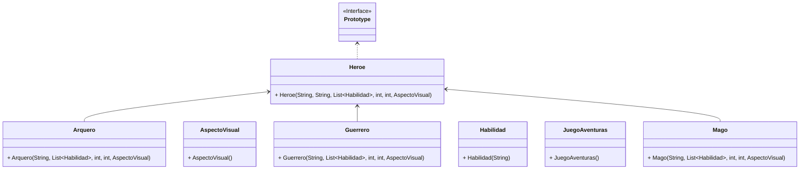

# Integrantes del equipo

- Juan David Marulanda
- Jefferson Morales Gonzalez
- Jhan Castro Vargas
- Laura Sofia Guio Camargo
- Natacha Castrillon
- Ruben Dario Suarez Amaya

## Problema vs patron seleccionado:

- ### Problema 1
  Imagina que estás desarrollando un videojuego de aventuras en el que los jugadores pueden controlar a un grupo de héroes con habilidades únicas. Necesitas implementar un sistema de clonación de personajes. Los jugadores deben poder clonar y personalizar héroes existentes para formar equipos estratégicos.

  Requerimientos del sistema:
    1. Los jugadores deben poder clonar a los héroes existentes en el juego para crear nuevos personajes con habilidades idénticas.
    2. Cada héroe tiene un conjunto único de habilidades especiales que incluyen ataques, defensas y habilidades mágicas.
    3. Los héroes pueden pertenecer a diferentes clases, como guerreros, magos o arqueros, y cada clase tiene su propio conjunto de habilidades
    4. Los jugadores deben poder personalizar los nombres y aspectos visuales de los héroes clonados después de la clonación.
    5. Los héroes deben mantener un registro de su experiencia, nivel y puntos de habilidad, y esta información debe copiarse correctamente al clonar un héroe.
    6. El sistema debe ser eficiente y permitir la creación de múltiples clones de un mismo héroe sin duplicar innecesariamente los datos.
  
  ### Patrón selecionado: Prototype 

  - > Se selecciona este patrón ya que es un patrón creacional que permite copiar objetos existentes sin que el código dependa de sus clases, utilizando una interfaz que permita su clonación, adicionalmente teniendo un método de clonación implementado en todas las clases. 

  ### Explicación: 
  Basados en la información entregada por el problema se detecta que la información clave del mismo es la necesidad de clonar objetos con sus diferentes caracteristicas y la posibilidad de agregar otros atributos a los objetos clonados. Para el proyecto se genera las siguientes interfaces y clases: 

    * *Heroe:* Clase abstracta que define el método de clone y creación que utilizará el resto de las clases. Además de tener los atributos iniciales
    * *Guerrero, Arquero, Mago:* Clase extendida de heroe que espefica las particularidades de los heros
    * *Habilidad:* Representa las habilidades específicas de un héroe.
    * *AspectoVisual:* Representa los aspectos visuales específicos de un héroe.
    * *JuegoAventuras:* Contiene el main del proyecto donde se puede crear un héroe original y clonarlos con ciertas caracteristicas. 

  ### Diagrama UML
  

- ### Problema 2

  La empresa está desarrollando una aplicación de mensajería en tiempo real que permite a los usuarios comunicarse desde
  múltiples dispositivos. Cada vez que un usuario recibe un nuevo mensaje, todos los dispositivos del usuario deben ser
  notificados para que el mensaje se muestre en cada uno de ellos. Para mantener la flexibilidad y desacoplar la lógica
  de notificación de la aplicación principal.

#### El patrón que escoja deberá permitir:

1. Notificación en Tiempo Real: Cada dispositivo del usuario debe recibir una notificación cuando llegue un nuevo
   mensaje.
2. Desacoplamiento: La aplicación de mensajería debe poder notificar a cualquier número de dispositivos sin saber
   detalles específicos sobre cada uno de ellos.
3. Flexibilidad: Los dispositivos pueden ser añadidos o eliminados en tiempo de ejecución sin necesidad de modificar la
   lógica principal de la aplicación.

### Patron seleccionado : Observer

- > Observer es un patrón de diseño de comportamiento que te permite definir un mecanismo de suscripción para notificar
  a varios objetos sobre cualquier evento que le suceda al objeto que están observando, que en este caso es objeto de
  observacion es el mensaje.

### Explicación:

- Basados en el planteamiento del problema, detectamos dos puntos claves importantes:> Tiempo Real / Recibe un nuevo
  mensaje.

  > Esto quiere decir que un evento debe disparar una acción en tiempo real, este evento sería la recepción de un nuevo
  mensaje y la acción es la notificación a los diferentes dispositivos por lo cual debe existir un observador que a la
  recepción del mensaje dispare el envío de notificaciones, esta básicamente es la problemática que resuelve el patrón
  observador.

* Interfaz Observer: Define el método update que será llamado por el sujeto cuando hay un nuevo mensaje.
* Interfaz Subject: Define los métodos para registrar, eliminar y notificar a los observadores.
* Clase MessageService: Implementa la interfaz Subject y gestiona la lista de observadores. Cuando recibe un nuevo
  mensaje, notifica a todos los observadores.
* Clases MobileDevice y TabletDevice: Implementan la interfaz Observer y definen cómo deben reaccionar los dispositivos
  cuando reciben un nuevo mensaje.
* Clase Main: Prueba la implementación del patrón Observer registrando varios dispositivos, enviando mensajes y
  demostrando la flexibilidad de agregar o eliminar dispositivos en tiempo de ejecución.

Este diseño asegura notificaciones en tiempo real, desacoplamiento y flexibilidad para añadir o eliminar dispositivos
sin modificar la lógica principal de la aplicación.

### Diagrama UML :

- ### Problema 3:
  En un proyecto de desarrollo de software para un sistema de gestión de restaurantes, debe
  buscar el patrón de diseño para ser aplicado para manejar la lógica común de
  procesamiento de órdenes de alimentos y bebidas.

    - Contexto:
      Imagina que estamos desarrollando un sistema de gestión de restaurantes que permite a
      los usuarios realizar pedidos en línea. Este sistema debe manejar una variedad de órdenes,
      que pueden incluir comida, bebidas y postres. Cada tipo de pedido tiene un proceso común,
      como la toma de pedido, la preparación, la verificación de disponibilidad, el cálculo de
      precios, etc.

    - Aplicación del Patrón:
      En este escenario, el patrón se aplicaría para definir una estructura común para el
      procesamiento de órdenes, mientras se permite a las subclases (por ejemplo, clase
      OrderFood, OrderBeverage, OrderDessert) implementar pasos específicos según el tipo de
      pedido.

    - El patrón que seleccione debe tener los siguientes beneficios:
    1. Encapsulación de la estructura del algoritmo común en una clase base.
    2. Flexibilidad para que las subclases implementen pasos específicos según el tipo de
       pedido.
    3. Evita la duplicación de código al reutilizar la estructura común.

#### Patrón seleccionado: Template Method
- >Template Method es un patrón de diseño de comportamiento que define el esqueleto de un algoritmo en la superclase pero permite que las subclases sobrescriban pasos del algoritmo sin cambiar su estructura.

Explicación:
> - En términos de encapsulamiento, se define la estructura/comportamiento base en una clase abstracta "Order"
> - Para la flexibilidad, se realiza una extensión de la clase abstracta "Order" en "OrderFood", "OrderBeverage" y "OrderDessert" modificando los pasos/comportamientos de acuerdo al tipo de pedido.
> - Al reutilizar la estructura, se evita la duplicidad de código. Además que cualquier cambio a la estructura base se puede realizar en un solo lugar (Clase base "Order")
> - Este patrón de diseño es ideal cuando se cuenta con una serie de pasos comunes en un algoritmo y las subclases deben seguirlos.

Explicación de las clases creadas:
> - *Order:* Clase abstracta que contiene el comportamientos/pasos comunes. 
> - *OrderBeverage:* Clase extendida de "Order" que ejecuta los comportamientos según las necesidades del tipo de pedido "Beverage". 
> - *OrderFood:* Clase extendida de "Order" que ejecuta los comportamientos según las necesidades del tipo de pedido "Food".
> - *OrderDessert:* Clase extendida de "Order" que ejecuta los comportamientos según las necesidades del tipo de pedido "Dessert".
> - *Main:* Utiliza un menú sencillo para probar la implementación del patrón, donde se selecciona el tipo de pedido (Food, Beverage o Dessert) y la cantidad para que el sistema verifique la disponibilidad de los productos de acuerdo al stock, prepare el pedido y calcule el precio del mismo, devolviendo estos valores al usuario final.
#### Diagrama UML :

- ### Problema 4

  Imagina un sistema de gestión de tareas en el que los usuarios pueden crear, editar,
  eliminar y completar tareas. Cada acción realizada por el usuario corresponde a una acción
  que debe ser ejecutada. Además, es importante mantener un registro de todas las acciones
  realizadas para permitir la reversión de las mismas si es necesario.

  #### El patrón que escoja deberá permitir:

    1. Desacopla el invocador de los objetos que realizan las acciones.
    2. Permite la extensión de nuevas operaciones sin modificar el código existente.
    3. Facilita el registro de acciones para realizar operaciones de reversión.

### Patron seleccionado : Command

> - Command es un patrón de diseño de comportamiento que convierte una solicitud en un objeto independiente que contiene
    toda la información sobre la solicitud. Esta transformación te permite parametrizar los métodos con diferentes
    solicitudes, retrasar o poner en cola la ejecución de una solicitud y soportar operaciones que no se pueden
    realizar.

### Explicación:

> - En este caso se tuvo en cuenta el requerimiento de las diferentes acciones que se pueden realizar, para esto vemos
    importante desacoplar cada acción del invocador y esto es algo que se puede resolver segregando los comandos en
    clases command.
> - Commant tambien nos permite agregar nuevos requerimientos de forma secilla asegurando la extensibilidad.
> - Finalmente el patron command nos permite tener un registro que nos ayuda a rastrear el historial de operaciones
    ejecutadas y hace posible revertir una operación si es necesario.

### Diagrama UML :

- ### Problema 5: 

  Imagina que estamos desarrollando un sistema para gestionar la decoración de habitaciones en un hotel de lujo. Cada habitación puede tener una decoración básica, pero los huéspedes pueden solicitar mejoras y adiciones para personalizar su experiencia. Estas mejoras pueden incluir servicios adicionales, como flores frescas, chocolate gourmet, vino de alta calidad, etc. 

  Aplicación del Patrón: En este escenario, el patrón que se seleccione se utilizará para agregar características adicionales y personalizadas a las habitaciones del hotel de manera dinámica.

  El patrón que seleccione debe tener los siguientes beneficios: 

  - Permite agregar nuevas funcionalidades a objetos existentes de manera dinámica.
  - Proporciona una alternativa flexible a la subclase para extender funcionalidades. 
  - Mejora la legibilidad y el mantenimiento del código al separar las preocupaciones.

  
  ### Patrón seleccionado : Decorator

    >    Decorator es un patrón de diseño estructural que te permite añadir funcionalidades a objetos colocando estos objetos dentro de objetos encapsuladores especiales que contienen estas funcionalidades.
      
    >  Dicho de otra manera: El objetivo de este patrón es expandir la funcionalidad de las clases de manera dinámica en tiempo de ejecución.

    >  Según este patrón, cualquier objeto puede complementarse con un comportamiento deseado sin afectar las funcionalidades de otros objetos de la misma clase.

    >  Este es uno de los patrones estructurales más utilizados.

  ### Explicación: 
  
   > La razón principal de la selección de este patrón obedece al requerimiento de permitir agregar nuevas funcionalidades a objetos existentes de manera dinámica. Esto complementado con la alternativa flexible a la subclase para extender funcionalidades.

   > En este caso vemos como la Clase FloresFrescas extiende de la clase HabitacionDecorator para indicar los valores adicionales de alquiler de la habitación cuando se soliciten estos servicios o características adicionales.
    
   > Con esto también certificamos lo que dice el patrón en relación a que cualquier objeto puede complementarse con un comportamiento deseado sin afectar las funcionalidades de otros objetos de la misma clase.

### Diagrama UML :

